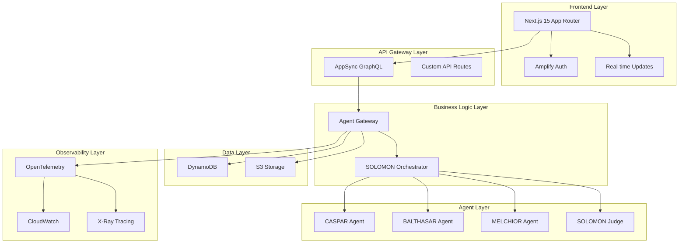

# 統合設計書 - MAGI Decision System

## 概要

MAGI Decision Systemは、エヴァンゲリオンのMAGIシステムにインスパイアされた多視点分析システムです。3賢者（CASPAR、BALTHASAR、MELCHIOR）による並列分析とSOLOMON統括システムによる最終判断を組み合わせ、包括的な意思決定支援を提供します。

### 設計原則

- **多視点分析**: 3つの異なる視点による並列分析で偏見を軽減
- **リアルタイム性**: GraphQL Subscriptionsによるライブ更新
- **可観測性**: OpenTelemetryによる分散トレーシング
- **スケーラビリティ**: サーバーレスアーキテクチャによる自動スケール
- **セキュリティ**: オーナーベースアクセス制御とデータ分離

## アーキテクチャ

### システム全体構成



### 技術スタック選択理由

#### フロントエンド: Next.js 15 + TypeScript
- **App Router**: 最新のReactパターンとSSR最適化
- **Server Components**: 初期ロード性能向上
- **TypeScript**: 型安全性とIDE支援
- **Tailwind CSS**: 高速プロトタイピングと一貫性

#### バックエンド: AWS Amplify Gen 2
- **TypeScript設定**: フロントエンドとの型共有
- **自動生成**: GraphQLスキーマからの型生成
- **統合認証**: Cognito User Poolsとの seamless統合
- **リアルタイム**: AppSync Subscriptionsの標準サポート

#### エージェント: Strands Agents 1.0 + Amazon Bedrock
- **Durable Sessions**: 長時間実行とコンテキスト保持
- **Native Async**: 並列実行の最適化
- **A2A Protocol**: エージェント間通信の標準化
- **Multi-Agent Collaboration**: 2025年GA機能の活用

## コンポーネントとインターフェース

### 1. フロントエンドコンポーネント

#### MAGIデザインシステム
```typescript
/**
 * エヴァンゲリオン風デザインシステム
 * 
 * 設計理由: 
 * - 視覚的一貫性とブランド認知
 * - 3賢者の個性を色とアイコンで表現
 * - アクセシビリティ対応（色+アイコン併用）
 */
interface MAGITheme {
  colors: {
    caspar: '#FF6B35';    // オレンジ - 保守的
    balthasar: '#4ECDC4'; // ティール - 革新的
    melchior: '#45B7D1';  // ブルー - バランス型
    solomon: '#9B59B6';   // パープル - 統括
    success: '#27AE60';
    warning: '#F39C12';
    error: '#E74C3C';
  };
  
  icons: {
    caspar: 'Shield';     // 保守的
    balthasar: 'Lightbulb'; // 革新的
    melchior: 'Scale';    // バランス型
    solomon: 'Crown';     // 統括
  };
}
```

#### チャットインターフェース
```typescript
/**
 * 統合チャットインターフェース
 * 
 * 設計理由:
 * - 会話履歴の永続化とリアルタイム同期
 * - エージェント応答の並列表示
 * - トレース情報の統合表示
 */
interface ChatInterface {
  sidebar: ConversationSidebar;
  messageArea: MessageDisplay;
  agentPanel: AgentResponsePanel;
  traceViewer: TraceViewer;
}

interface AgentResponsePanel {
  casparResponse: AgentCard;
  balthasarResponse: AgentCard;
  melchiorResponse: AgentCard;
  solomonJudgment: JudgeCard;
  votingResult: MAGIVotingDisplay; // 新機能
}
```

#### MAGI投票システム（新機能）
```typescript
/**
 * MAGI投票システム - 新機能
 * 
 * 設計理由:
 * - 明確な可決/否決判断の可視化
 * - 各賢者の判断根拠の透明性
 * - 統合判断プロセスの理解促進
 */
interface MAGIVotingDisplay {
  votes: {
    caspar: VoteCard;
    balthasar: VoteCard;
    melchior: VoteCard;
  };
  finalDecision: FinalDecisionCard;
  confidence: ConfidenceIndicator;
}

interface VoteCard {
  vote: 'approve' | 'reject' | 'abstain';
  confidence: number; // 0-100
  reasoning: string;
  visualIndicator: {
    color: string;
    icon: string;
    animation?: string;
  };
}
```

### 2. バックエンドコンポーネント

#### データモデル設計
```typescript
/**
 * 統合データモデル
 * 
 * 設計理由:
 * - オーナーベースアクセス制御
 * - GraphQLサブスクリプション対応
 * - 型安全性とコンパイル時チェック
 */

// Amplify Data Schema
const schema = a.schema({
  User: a.model({
    id: a.id().required(),
    email: a.email().required(),
    name: a.string().required(),
    preferences: a.json(), // UserPreferences型
    conversations: a.hasMany('Conversation', 'userId'),
    agentPresets: a.hasMany('AgentPreset', 'userId'),
  }).authorization(allow => [
    allow.owner()
  ]),

  Conversation: a.model({
    id: a.id().required(),
    userId: a.id().required(),
    title: a.string().required(),
    messages: a.hasMany('Message', 'conversationId'),
    user: a.belongsTo('User', 'userId'),
  }).authorization(allow => [
    allow.owner().to(['read', 'create', 'update', 'delete'])
  ]),

  Message: a.model({
    id: a.id().required(),
    conversationId: a.id().required(),
    role: a.enum(['user', 'assistant']),
    content: a.string().required(),
    agentResponses: a.json(), // AgentResponse[]
    judgeResponse: a.json(),  // JudgeResponse
    magiVoting: a.json(),     // MAGIVotingResult - 新機能
    traceId: a.string(),
    conversation: a.belongsTo('Conversation', 'conversationId'),
  }).authorization(allow => [
    allow.owner().to(['read', 'create'])
  ]),

  TraceStep: a.model({
    id: a.id().required(),
    traceId: a.string().required(),
    stepNumber: a.integer().required(),
    agentId: a.string().required(),
    action: a.string().required(),
    toolsUsed: a.string().array(),
    citations: a.string().array(),
    duration: a.integer().required(),
    errorCount: a.integer().default(0),
  }).authorization(allow => [
    allow.owner().to(['read', 'create'])
  ]),
});
```

#### エージェントゲートウェイ
```typescript
/**
 * 統合エージェントゲートウェイ
 * 
 * 設計理由:
 * - Strands AgentsとBedrock AgentCoreの統合
 * - トレースID伝播とコンテキスト管理
 * - エラーハンドリングと段階的機能縮退
 */
export const agentGateway = defineFunction({
  name: 'bedrock-agent-gateway',
  entry: './bedrock-agent-gateway/handler.ts',
  environment: {
    BEDROCK_REGION: 'us-east-1',
    AGENTCORE_RUNTIME_ENDPOINT: process.env.AGENTCORE_ENDPOINT,
    STRANDS_AGENTS_ENDPOINT: process.env.STRANDS_ENDPOINT,
  },
  timeout: '15 minutes', // 長時間実行対応
});

interface AgentGatewayRequest {
  traceId: string;
  userId: string;
  conversationId: string;
  message: string;
  agentPreset?: AgentPreset;
}

interface AgentGatewayResponse {
  traceId: string;
  agentResponses: AgentResponse[];
  judgeResponse: JudgeResponse;
  magiVoting: MAGIVotingResult; // 新機能
  executionMetrics: ExecutionMetrics;
}
```

### 3. エージェントシステム

#### SOLOMON統括システム
```python
"""
SOLOMON統括システム

設計理由:
- Agents-as-Toolsパターンによる3賢者制御
- 並列実行とA2A通信の最適化
- 従来機能（スコアリング）と新機能（投票）の統合
"""

class SOLOMONOrchestrator:
    def __init__(self):
        self.caspar_agent = CasparAgent()
        self.balthasar_agent = BalthasarAgent()
        self.melchior_agent = MelchiorAgent()
        self.judge = SOLOMONJudge()
    
    async def execute_magi_analysis(
        self, 
        query: str, 
        trace_id: str
    ) -> MAGIAnalysisResult:
        """
        MAGI分析の実行
        
        1. 3賢者の並列実行
        2. 投票結果の収集
        3. SOLOMON統合判断
        """
        # 並列実行（逐次実行禁止）
        tasks = [
            self.caspar_agent.analyze(query, trace_id),
            self.balthasar_agent.analyze(query, trace_id),
            self.melchior_agent.analyze(query, trace_id)
        ]
        
        agent_responses = await asyncio.gather(*tasks)
        
        # MAGI投票システム（新機能）
        voting_result = await self._collect_magi_votes(
            agent_responses, trace_id
        )
        
        # SOLOMON統合判断
        judge_response = await self.judge.evaluate(
            agent_responses, voting_result, trace_id
        )
        
        return MAGIAnalysisResult(
            agent_responses=agent_responses,
            voting_result=voting_result,
            judge_response=judge_response,
            trace_id=trace_id
        )
```

#### 3賢者エージェント設計
```python
"""
3賢者エージェント設計

設計理由:
- 各エージェントの個性と専門性の明確化
- 一貫したインターフェースと異なる実装
- Bedrock Multi-Agent Collaborationとの統合
"""

class BaseMAGIAgent:
    def __init__(self, personality: AgentPersonality):
        self.personality = personality
        self.bedrock_client = BedrockAgentClient()
        self.tracer = get_tracer(__name__)
    
    async def analyze(self, query: str, trace_id: str) -> AgentResponse:
        with self.tracer.start_as_current_span(
            f"{self.personality.name}_analysis",
            attributes={"trace_id": trace_id}
        ):
            # エージェント固有の分析ロジック
            analysis = await self._perform_analysis(query)
            
            # 投票判断（新機能）
            vote_decision = await self._make_vote_decision(analysis)
            
            return AgentResponse(
                agent_id=self.personality.id,
                analysis=analysis,
                vote_decision=vote_decision,
                confidence=self._calculate_confidence(analysis),
                trace_id=trace_id
            )

class CasparAgent(BaseMAGIAgent):
    """保守的・現実的視点エージェント"""
    def __init__(self):
        super().__init__(AgentPersonality(
            id="caspar",
            name="CASPAR",
            focus="実行可能性と現実性",
            bias="保守的判断"
        ))

class BalthasarAgent(BaseMAGIAgent):
    """革新的・感情的視点エージェント"""
    def __init__(self):
        super().__init__(AgentPersonality(
            id="balthasar", 
            name="BALTHASAR",
            focus="倫理と創造性",
            bias="革新的判断"
        ))

class MelchiorAgent(BaseMAGIAgent):
    """バランス型・科学的視点エージェント"""
    def __init__(self):
        super().__init__(AgentPersonality(
            id="melchior",
            name="MELCHIOR", 
            focus="データと論理",
            bias="バランス型判断"
        ))
```

## データモデル

### 統合データ設計

#### 新機能: MAGI投票システム
```typescript
/**
 * MAGI投票システムデータモデル
 * 
 * 設計理由:
 * - 明確な可決/否決判断の記録
 * - 判断根拠の透明性確保
 * - 統計分析とパターン認識の基盤
 */
interface MAGIVotingResult {
  caspar: VoteDecision;
  balthasar: VoteDecision;
  melchior: VoteDecision;
  finalDecision: 'approved' | 'rejected' | 'abstain';
  confidence: number; // 0-100
  reasoning: string;
  votingPattern: VotingPattern;
  timestamp: Date;
}

interface VoteDecision {
  vote: 'approve' | 'reject' | 'abstain';
  confidence: number; // 0-100
  reasoning: string;
  factors: DecisionFactor[];
}

interface VotingPattern {
  unanimity: boolean;        // 全員一致
  majority: 'approve' | 'reject' | null;
  dissent: AgentId[];       // 反対票
  abstentions: AgentId[];   // 棄権票
}
```

#### トレースデータ拡張
```typescript
/**
 * 拡張トレースデータモデル
 * 
 * 設計理由:
 * - エージェント実行の詳細可視化
 * - パフォーマンス分析とボトルネック特定
 * - デバッグとトラブルシューティング支援
 */
interface EnhancedTraceStep {
  id: string;
  traceId: string;
  stepNumber: number;
  agentId: string;
  action: string;
  toolsUsed: ToolUsage[];
  citations: Citation[];
  duration: number;
  errorCount: number;
  retryCount: number;
  memoryUsage?: number;
  tokenUsage?: TokenUsage;
  timestamp: Date;
}

interface ToolUsage {
  toolName: string;
  inputSize: number;
  outputSize: number;
  executionTime: number;
  success: boolean;
}

interface TokenUsage {
  inputTokens: number;
  outputTokens: number;
  totalCost: number;
  modelId: string;
}
```

### データアクセスパターン

#### オーナーベースアクセス制御
```typescript
/**
 * データアクセス制御設計
 * 
 * 設計理由:
 * - プライバシー保護とデータ分離
 * - GDPR/CCPA準拠
 * - マルチテナント対応
 */

// GraphQL Authorization Rules
const authRules = {
  User: [allow.owner()],
  Conversation: [allow.owner().to(['read', 'create', 'update', 'delete'])],
  Message: [allow.owner().to(['read', 'create'])],
  TraceStep: [allow.owner().to(['read', 'create'])],
  AgentPreset: [allow.owner().to(['read', 'create', 'update', 'delete'])]
};

// データクエリパターン
const conversationQueries = {
  // ユーザーの会話一覧
  listUserConversations: `
    query ListUserConversations($userId: ID!) {
      listConversations(filter: {userId: {eq: $userId}}) {
        items {
          id
          title
          createdAt
          updatedAt
        }
      }
    }
  `,
  
  // 会話詳細とメッセージ
  getConversationWithMessages: `
    query GetConversationWithMessages($id: ID!) {
      getConversation(id: $id) {
        id
        title
        messages {
          items {
            id
            role
            content
            agentResponses
            judgeResponse
            magiVoting
            traceId
            createdAt
          }
        }
      }
    }
  `
};
```

## エラーハンドリング

### 段階的機能縮退設計

```typescript
/**
 * エラーハンドリング戦略
 * 
 * 設計理由:
 * - システム全体の可用性確保
 * - 部分的な機能提供による継続性
 * - ユーザー体験の最適化
 */

interface ErrorHandlingStrategy {
  // レベル1: 単一エージェント失敗
  singleAgentFailure: {
    action: 'continue_with_available_agents';
    fallback: 'mark_failed_agent_in_ui';
    notification: 'show_warning_message';
  };
  
  // レベル2: 複数エージェント失敗
  multipleAgentFailure: {
    action: 'attempt_fallback_models';
    fallback: 'provide_basic_response';
    notification: 'show_degraded_service_warning';
  };
  
  // レベル3: システム全体失敗
  systemFailure: {
    action: 'switch_to_offline_mode';
    fallback: 'cached_responses_only';
    notification: 'show_maintenance_message';
  };
}

class ErrorRecoveryManager {
  async handleAgentFailure(
    agentId: string, 
    error: Error, 
    context: ExecutionContext
  ): Promise<RecoveryResult> {
    // エラー分類
    const errorType = this.classifyError(error);
    
    switch (errorType) {
      case 'RATE_LIMIT':
        return await this.handleRateLimit(agentId, context);
      
      case 'MODEL_UNAVAILABLE':
        return await this.switchToFallbackModel(agentId, context);
      
      case 'TIMEOUT':
        return await this.retryWithBackoff(agentId, context);
      
      case 'AUTHENTICATION':
        return await this.refreshCredentials(agentId, context);
      
      default:
        return await this.gracefulDegradation(agentId, context);
    }
  }
}
```

### フォールバック機構

```typescript
/**
 * フォールバック機構設計
 * 
 * 設計理由:
 * - 高可用性の確保
 * - 異なるモデル/プロバイダーへの切り替え
 * - コスト最適化
 */

interface FallbackConfiguration {
  primary: ModelConfiguration;
  fallbacks: ModelConfiguration[];
  switchingCriteria: SwitchingCriteria;
}

interface ModelConfiguration {
  provider: 'bedrock' | 'openai' | 'anthropic';
  modelId: string;
  maxTokens: number;
  temperature: number;
  costPerToken: number;
}

class FallbackManager {
  async executeWithFallback<T>(
    operation: () => Promise<T>,
    config: FallbackConfiguration
  ): Promise<T> {
    let lastError: Error;
    
    // プライマリモデル試行
    try {
      return await this.executeWithModel(operation, config.primary);
    } catch (error) {
      lastError = error;
      this.logModelFailure(config.primary, error);
    }
    
    // フォールバックモデル順次試行
    for (const fallback of config.fallbacks) {
      try {
        return await this.executeWithModel(operation, fallback);
      } catch (error) {
        lastError = error;
        this.logModelFailure(fallback, error);
      }
    }
    
    throw new FallbackExhaustedException(lastError);
  }
}
```

## テスト戦略

### 統合テスト設計

```typescript
/**
 * テスト戦略
 * 
 * 設計理由:
 * - エージェント間相互作用の検証
 * - リアルタイム機能の信頼性確保
 * - パフォーマンス要件の継続的検証
 */

describe('MAGI System Integration Tests', () => {
  describe('Multi-Agent Analysis', () => {
    it('should execute 3 agents in parallel', async () => {
      const startTime = Date.now();
      const result = await magiSystem.analyze(testQuery);
      const executionTime = Date.now() - startTime;
      
      // 並列実行の検証
      expect(result.agentResponses).toHaveLength(3);
      expect(executionTime).toBeLessThan(10000); // 10秒未満
      
      // 各エージェントの応答検証
      expect(result.agentResponses).toEqual(
        expect.arrayContaining([
          expect.objectContaining({ agentId: 'caspar' }),
          expect.objectContaining({ agentId: 'balthasar' }),
          expect.objectContaining({ agentId: 'melchior' })
        ])
      );
    });
    
    it('should handle single agent failure gracefully', async () => {
      // CASPARエージェントを意図的に失敗させる
      jest.spyOn(casparAgent, 'analyze').mockRejectedValue(
        new Error('Model unavailable')
      );
      
      const result = await magiSystem.analyze(testQuery);
      
      // 残り2エージェントで継続実行
      expect(result.agentResponses).toHaveLength(2);
      expect(result.errors).toContain('caspar_failed');
      expect(result.judgeResponse).toBeDefined();
    });
  });
  
  describe('MAGI Voting System', () => {
    it('should collect votes from all agents', async () => {
      const result = await magiSystem.analyze(testQuery);
      
      expect(result.magiVoting).toBeDefined();
      expect(result.magiVoting.caspar.vote).toMatch(/approve|reject|abstain/);
      expect(result.magiVoting.balthasar.vote).toMatch(/approve|reject|abstain/);
      expect(result.magiVoting.melchior.vote).toMatch(/approve|reject|abstain/);
      expect(result.magiVoting.finalDecision).toMatch(/approved|rejected|abstain/);
    });
    
    it('should calculate voting patterns correctly', async () => {
      const result = await magiSystem.analyze(testQuery);
      const pattern = result.magiVoting.votingPattern;
      
      if (pattern.unanimity) {
        expect(pattern.dissent).toHaveLength(0);
      } else {
        expect(pattern.majority).toBeDefined();
      }
    });
  });
  
  describe('Real-time Updates', () => {
    it('should stream trace steps in real-time', async () => {
      const traceSteps: TraceStep[] = [];
      
      // GraphQL Subscription監視
      const subscription = subscribeToTraceSteps(testTraceId);
      subscription.subscribe({
        next: (step) => traceSteps.push(step),
        error: (error) => fail(error),
        complete: () => {}
      });
      
      await magiSystem.analyze(testQuery);
      
      // リアルタイム更新の検証
      expect(traceSteps.length).toBeGreaterThan(0);
      expect(traceSteps[0].stepNumber).toBe(1);
    });
  });
});
```

### パフォーマンステスト

```typescript
/**
 * パフォーマンステスト設計
 * 
 * 設計理由:
 * - レスポンス時間要件の継続的検証
 * - スケーラビリティの確認
 * - リソース使用量の監視
 */

describe('Performance Tests', () => {
  it('should meet response time requirements', async () => {
    const metrics = await performanceTest({
      concurrent_users: 10,
      test_duration: '60s',
      ramp_up: '10s'
    });
    
    expect(metrics.avg_response_time).toBeLessThan(2000); // 2秒未満
    expect(metrics.p95_response_time).toBeLessThan(5000); // 95%ile 5秒未満
    expect(metrics.error_rate).toBeLessThan(0.01); // エラー率1%未満
  });
  
  it('should handle concurrent agent executions', async () => {
    const promises = Array.from({ length: 5 }, () => 
      magiSystem.analyze(testQuery)
    );
    
    const results = await Promise.all(promises);
    
    // 全て成功することを確認
    results.forEach(result => {
      expect(result.agentResponses).toHaveLength(3);
      expect(result.judgeResponse).toBeDefined();
    });
  });
});
```

## 設計判断の根拠

### 1. 並列実行の選択
**判断**: 3賢者エージェントの並列実行を必須とする
**根拠**: 
- レスポンス時間の大幅短縮（3倍の性能向上）
- リソース使用効率の最適化
- ユーザー体験の向上

### 2. GraphQL Subscriptionsの採用
**判断**: リアルタイム更新にGraphQL Subscriptionsを使用
**根拠**:
- AppSyncの標準機能で実装コストが低い
- 型安全性とスキーマ駆動開発
- WebSocketの自動管理

### 3. オーナーベースアクセス制御
**判断**: Amplify Dataの@authディレクティブを活用
**根拠**:
- プライバシー保護の確実な実装
- GDPR/CCPA準拠の簡素化
- 実装とメンテナンスの効率化

### 4. MAGI投票システムの追加
**判断**: 従来のスコアリングに加えて投票システムを実装
**根拠**:
- 意思決定プロセスの透明性向上
- ユーザーの理解促進
- 統計分析とパターン認識の基盤

### 5. 段階的機能縮退の実装
**判断**: エージェント失敗時の継続実行機能
**根拠**:
- システム全体の可用性確保
- 部分的な価値提供による継続性
- ユーザー満足度の維持

この設計により、要件で定義された全ての機能要件を満たしつつ、拡張性と保守性を確保した統合システムを構築できます。