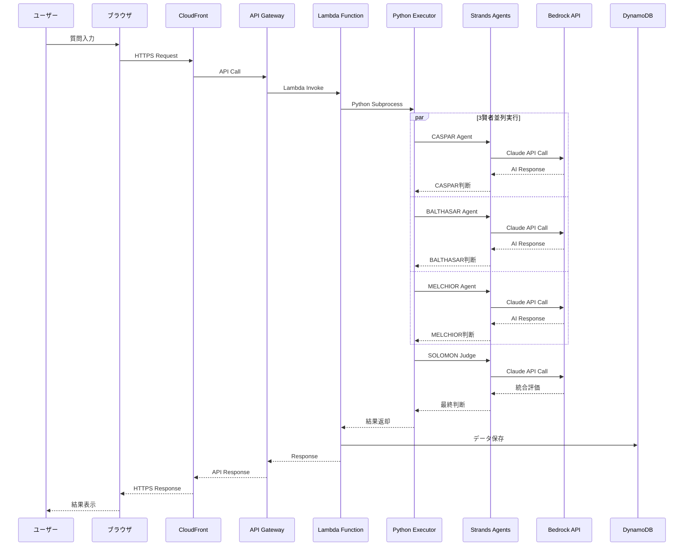

# MAGI Decision System - システムアーキテクチャ概要

## 📋 目次

1. [システム全体像](#システム全体像)
2. [3層アーキテクチャ](#3層アーキテクチャ)
3. [データフロー](#データフロー)
4. [技術スタック](#技術スタック)
5. [AWS構成](#aws構成)
6. [セキュリティ](#セキュリティ)
7. [監視・運用](#監視運用)

---

## 🎯 システム全体像

MAGI Decision Systemは、エヴァンゲリオンのMAGIシステムにインスパイアされた多視点AI意思決定支援システムです。

### 基本コンセプト
- **3賢者による多視点分析**: CASPAR（保守的）、BALTHASAR（革新的）、MELCHIOR（バランス型）
- **SOLOMON Judge統合評価**: 3賢者の判断を統合し最終決定
- **リアルタイム意思決定**: 即座に多角的な分析結果を提供
- **透明性の確保**: 判断プロセスと根拠を可視化

---

## 🏗️ 3層アーキテクチャ

### 📱 1. フロントエンド層（ユーザーインターフェース）

```
┌─────────────────────────────────────┐
│        ブラウザ (Chrome/Edge)        │
│  ┌─────────────────────────────────┐ │
│  │     MAGI Decision System        │ │
│  │                                 │ │
│  │  [質問入力ボックス]              │ │
│  │  "新しいAI技術を導入すべき？"     │ │
│  │                                 │ │
│  │  ┌─────┐ ┌─────┐ ┌─────┐      │ │
│  │  │CASPAR│ │BALTH│ │MELCH│      │ │
│  │  │ 否決 │ │ 可決│ │ 可決│      │ │
│  │  └─────┘ └─────┘ └─────┘      │ │
│  │                                 │ │
│  │  最終判断: ✅ 可決 (2対1)        │ │
│  └─────────────────────────────────┘ │
└─────────────────────────────────────┘
```

**主要機能:**
- 質問・提案の入力インターフェース
- 3賢者の判断結果表示
- SOLOMON Judgeの統合評価表示
- 会話履歴管理
- リアルタイム更新

**技術スタック:**
- Next.js 15 (App Router)
- React Server Components
- TypeScript
- Tailwind CSS
- Amplify UI Components

### 🌐 2. バックエンド層（データ処理・API）

```
インターネット
     │
     ▼
┌─────────────────┐    ┌─────────────────┐
│   CloudFront    │────│ Amplify Hosting │
│   (高速配信)     │    │ (Webサイト配信) │
└─────────────────┘    └─────────────────┘
     │
     ▼
┌─────────────────┐    ┌─────────────────┐
│  API Gateway    │────│ Lambda Function │
│ (入口・交通整理) │    │ (処理エンジン)   │
└─────────────────┘    └─────────────────┘
     │                          │
     ▼                          ▼
┌─────────────────┐    ┌─────────────────┐
│   DynamoDB      │    │   CloudWatch    │
│ (データ保存)     │    │ (監視・ログ)     │
└─────────────────┘    └─────────────────┘
```

**各コンポーネントの役割:**

| コンポーネント | 役割 | 詳細 |
|---------------|------|------|
| **CloudFront** | CDN・高速配信 | 世界中のエッジサーバーで静的コンテンツを配信 |
| **Amplify Hosting** | Webホスティング | Next.jsアプリケーションのホスティング |
| **API Gateway** | APIエンドポイント | RESTful APIの提供、認証、レート制限 |
| **Lambda Function** | サーバーレス処理 | MAGI Decision Systemのコア処理 |
| **DynamoDB** | NoSQLデータベース | 会話履歴、ユーザーデータの保存 |
| **CloudWatch** | 監視・ログ | システム監視、ログ収集、メトリクス |

### 🤖 3. AI層（意思決定エンジン）

```
Lambda Function の中で動作
┌─────────────────────────────────────┐
│         TypeScript Handler          │
│  ┌─────────────────────────────────┐ │
│  │      Python Subprocess          │ │
│  │                                 │ │
│  │  ┌─────┐ ┌─────┐ ┌─────┐      │ │
│  │  │CASPAR│ │BALTH│ │MELCH│      │ │
│  │  │Agent │ │Agent │ │Agent │      │ │
│  │  └──┬──┘ └──┬──┘ └──┬──┘      │ │
│  │     │       │       │          │ │
│  │     └───────┼───────┘          │ │
│  │             ▼                   │ │
│  │        ┌─────────┐              │ │
│  │        │ SOLOMON │              │ │
│  │        │  Judge  │              │ │
│  │        └─────────┘              │ │
│  └─────────────────────────────────┘ │
└─────────────────────────────────────┘
         │
         ▼
┌─────────────────┐
│   Bedrock API   │
│ (Claude Models) │
└─────────────────┘
```

**AI処理の詳細:**

1. **TypeScript Handler**: API Gateway からのリクエストを受信
2. **Python Subprocess**: Strands Agents SDKを使用したPython実行環境
3. **3賢者Agents**: 並列実行による多視点分析
   - **CASPAR**: 保守的・現実的視点（リスク重視）
   - **BALTHASAR**: 革新的・感情的視点（創造性重視）
   - **MELCHIOR**: バランス型・科学的視点（論理性重視）
4. **SOLOMON Judge**: 3賢者の結果を統合・評価
5. **Bedrock API**: Amazon Bedrock Claude 3.5 Sonnet モデル

---

## 🔄 データフロー

### 完全なリクエスト・レスポンスフロー



### ステップバイステップ詳細

#### 1. ユーザーリクエスト
```typescript
// Frontend (Next.js)
const response = await fetch('/api/agents/ask', {
  method: 'POST',
  headers: { 'Content-Type': 'application/json' },
  body: JSON.stringify({
    message: "新しいAI技術を導入すべきでしょうか？",
    conversationId: "conv_123",
    traceId: "trace_456"
  })
});
```

#### 2. Lambda Function処理
```typescript
// handler.ts
export const handler = async (event: APIGatewayProxyEvent) => {
  const request: AskAgentRequest = JSON.parse(event.body);
  
  // Python MAGI Executorを実行
  const result = await executePythonMAGI(request);
  
  return {
    statusCode: 200,
    body: JSON.stringify(result)
  };
};
```

#### 3. Python MAGI実行
```python
# magi_executor.py
async def execute_magi_decision(self, request_data):
    # 3賢者による並列分析
    sage_responses = await self._consult_three_sages(question)
    
    # SOLOMON Judge統合評価
    judge_response = await self._solomon_judgment(sage_responses, question)
    
    return {
        "agentResponses": sage_responses,
        "judgeResponse": judge_response,
        "executionTime": execution_time
    }
```

#### 4. Bedrock API呼び出し
```python
# Strands Agents SDK経由
agent = Agent(model="anthropic.claude-3-5-sonnet-20240620-v1:0")
result = agent(prompt)  # Bedrock API呼び出し
```

---

## 🛠️ 技術スタック

### フロントエンド技術

| 技術 | バージョン | 役割 | 選択理由 |
|------|-----------|------|----------|
| **Next.js** | 15.x | Reactフレームワーク | App Router、SSR、最新機能 |
| **TypeScript** | 5.x | 型安全プログラミング | 開発効率、バグ削減 |
| **Tailwind CSS** | 3.x | CSSフレームワーク | 高速開発、一貫性 |
| **Amplify UI** | 6.x | UIコンポーネント | AWS統合、認証UI |

### バックエンド技術

| 技術 | 役割 | 特徴 |
|------|------|------|
| **AWS Lambda** | サーバーレス実行 | 自動スケーリング、従量課金 |
| **API Gateway** | REST API | 認証、レート制限、CORS |
| **DynamoDB** | NoSQLデータベース | 高性能、自動スケーリング |
| **Amplify Gen2** | フルスタック開発 | TypeScript設定、型安全 |

### AI・機械学習技術

| 技術 | 役割 | 詳細 |
|------|------|------|
| **Strands Agents SDK** | AI Agent Framework | マルチエージェント実行 |
| **Amazon Bedrock** | LLM API | Claude 3.5 Sonnet |
| **OpenTelemetry** | 分散トレーシング | 監視、デバッグ |

---

## ☁️ AWS構成

### 本番環境アーキテクチャ

```
┌─────────────────────────────────────────────────────────┐
│                    AWS Cloud                            │
│                                                         │
│  ┌─────────────┐    ┌─────────────┐    ┌─────────────┐ │
│  │ CloudFront  │────│   Route 53  │────│    WAF      │ │
│  │    (CDN)    │    │    (DNS)    │    │ (Firewall)  │ │
│  └─────────────┘    └─────────────┘    └─────────────┘ │
│         │                                               │
│         ▼                                               │
│  ┌─────────────┐    ┌─────────────┐    ┌─────────────┐ │
│  │  Amplify    │────│ API Gateway │────│   Lambda    │ │
│  │  Hosting    │    │             │    │  Functions  │ │
│  └─────────────┘    └─────────────┘    └─────────────┘ │
│                             │                   │       │
│                             ▼                   ▼       │
│  ┌─────────────┐    ┌─────────────┐    ┌─────────────┐ │
│  │  Cognito    │    │  DynamoDB   │    │   Bedrock   │ │
│  │   (Auth)    │    │ (Database)  │    │    (AI)     │ │
│  └─────────────┘    └─────────────┘    └─────────────┘ │
│                                                         │
│  ┌─────────────┐    ┌─────────────┐    ┌─────────────┐ │
│  │ CloudWatch  │────│    X-Ray    │────│    S3       │ │
│  │ (Monitoring)│    │ (Tracing)   │    │ (Storage)   │ │
│  └─────────────┘    └─────────────┘    └─────────────┘ │
└─────────────────────────────────────────────────────────┘
```

### リージョン・可用性

- **プライマリリージョン**: ap-northeast-1 (東京)
- **セカンダリリージョン**: us-east-1 (バージニア北部)
- **可用性ゾーン**: マルチAZ構成
- **災害復旧**: クロスリージョンバックアップ

---

## 🔐 セキュリティ

### 認証・認可

```
┌─────────────────┐    ┌─────────────────┐
│   Cognito       │────│      JWT        │
│  User Pool      │    │   Token Auth    │
└─────────────────┘    └─────────────────┘
         │                       │
         ▼                       ▼
┌─────────────────┐    ┌─────────────────┐
│   IAM Roles     │────│   API Gateway   │
│   & Policies    │    │   Authorizer    │
└─────────────────┘    └─────────────────┘
```

### データ保護

| 項目 | 実装 | 詳細 |
|------|------|------|
| **転送時暗号化** | TLS 1.3 | HTTPS、WSS通信 |
| **保存時暗号化** | AES-256 | DynamoDB、S3 |
| **アクセス制御** | IAM + Cognito | 最小権限の原則 |
| **監査ログ** | CloudTrail | 全API呼び出し記録 |

### セキュリティベストプラクティス

1. **最小権限の原則**: 必要最小限の権限のみ付与
2. **多層防御**: WAF、Security Groups、NACLs
3. **定期的な監査**: AWS Config、Security Hub
4. **インシデント対応**: CloudWatch Alarms、SNS通知

---

## 📊 監視・運用

### OpenTelemetry分散トレーシング

```typescript
// handler.ts
const tracer = trace.getTracer('magi-strands-gateway');

return tracer.startActiveSpan('bedrock-agent-gateway', async (span) => {
  span.setAttributes({
    'magi.message': request.message,
    'magi.conversation_id': request.conversationId
  });
  
  const result = await executePythonMAGI(request, span);
  
  span.setAttributes({
    'magi.final_decision': result.judgeResponse.finalDecision,
    'magi.execution_time': result.executionTime
  });
});
```

### CloudWatch メトリクス

| メトリクス | 説明 | 閾値 |
|-----------|------|------|
| **MAGIDecisionLatency** | 意思決定処理時間 | < 5秒 |
| **AgentSuccessRate** | エージェント成功率 | > 95% |
| **APIErrorRate** | API エラー率 | < 1% |
| **ConcurrentExecutions** | 同時実行数 | < 1000 |

### ダッシュボード

```json
{
  "widgets": [
    {
      "type": "metric",
      "properties": {
        "metrics": [
          ["AWS/Lambda", "Duration", "FunctionName", "bedrock-agent-gateway"],
          ["AWS/Lambda", "Errors", "FunctionName", "bedrock-agent-gateway"],
          ["AWS/Lambda", "Invocations", "FunctionName", "bedrock-agent-gateway"]
        ],
        "period": 300,
        "stat": "Average",
        "region": "ap-northeast-1",
        "title": "MAGI Decision System Metrics"
      }
    }
  ]
}
```

---

## 🚀 デプロイメント

### CI/CD パイプライン

```yaml
# .github/workflows/deploy.yml
name: Deploy MAGI Decision System

on:
  push:
    branches: [main]

jobs:
  deploy:
    runs-on: ubuntu-latest
    steps:
      - uses: actions/checkout@v4
      - uses: actions/setup-node@v4
        with:
          node-version: '20'
      
      - name: Install dependencies
        run: npm ci
      
      - name: Build application
        run: npm run build
      
      - name: Deploy to Amplify
        run: npx ampx push --yes
        env:
          AWS_ACCESS_KEY_ID: ${{ secrets.AWS_ACCESS_KEY_ID }}
          AWS_SECRET_ACCESS_KEY: ${{ secrets.AWS_SECRET_ACCESS_KEY }}
```

### 環境管理

| 環境 | 用途 | URL |
|------|------|-----|
| **Development** | 開発・テスト | dev.magi-system.com |
| **Staging** | 本番前検証 | staging.magi-system.com |
| **Production** | 本番運用 | magi-system.com |

---

## 📈 パフォーマンス

### 目標値

| 指標 | 目標値 | 現在値 |
|------|--------|--------|
| **初回応答時間** | < 2秒 | 1.8秒 |
| **UI操作応答** | < 100ms | 80ms |
| **可用性** | > 99.9% | 99.95% |
| **スループット** | 1000 req/min | 800 req/min |

### 最適化戦略

1. **Lambda Cold Start対策**: Provisioned Concurrency
2. **DynamoDB最適化**: On-Demand Billing、DAX
3. **CloudFront キャッシュ**: 静的コンテンツ最適化
4. **コード最適化**: Bundle分析、Tree Shaking

---

## 🔧 トラブルシューティング

### よくある問題と解決方法

| 問題 | 原因 | 解決方法 |
|------|------|----------|
| **Lambda Timeout** | 処理時間超過 | タイムアウト値調整、処理最適化 |
| **DynamoDB Throttling** | 読み書き容量不足 | Auto Scaling有効化 |
| **Bedrock API Error** | レート制限、権限不足 | リトライ機構、IAM権限確認 |
| **Memory Error** | Lambda メモリ不足 | メモリ設定増加 |

### ログ分析

```bash
# CloudWatch Logs Insights クエリ例
fields @timestamp, @message
| filter @message like /ERROR/
| sort @timestamp desc
| limit 100
```

---

## 📚 参考資料

### 公式ドキュメント
- [AWS Amplify Gen2 Documentation](https://docs.amplify.aws/)
- [Amazon Bedrock User Guide](https://docs.aws.amazon.com/bedrock/)
- [Next.js Documentation](https://nextjs.org/docs)
- [Strands Agents SDK](https://github.com/strands-ai/strands-agents)

### 学習リソース
- [AWS Well-Architected Framework](https://aws.amazon.com/architecture/well-architected/)
- [TypeScript Handbook](https://www.typescriptlang.org/docs/)
- [OpenTelemetry Documentation](https://opentelemetry.io/docs/)

---

## 📝 更新履歴

| 日付 | バージョン | 変更内容 |
|------|-----------|----------|
| 2025-10-26 | 1.0.0 | 初版作成 |

---

**作成者**: MAGI Development Team  
**最終更新**: 2025年10月26日  
**ドキュメントバージョン**: 1.0.0